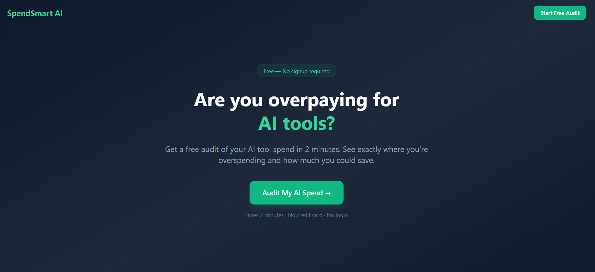
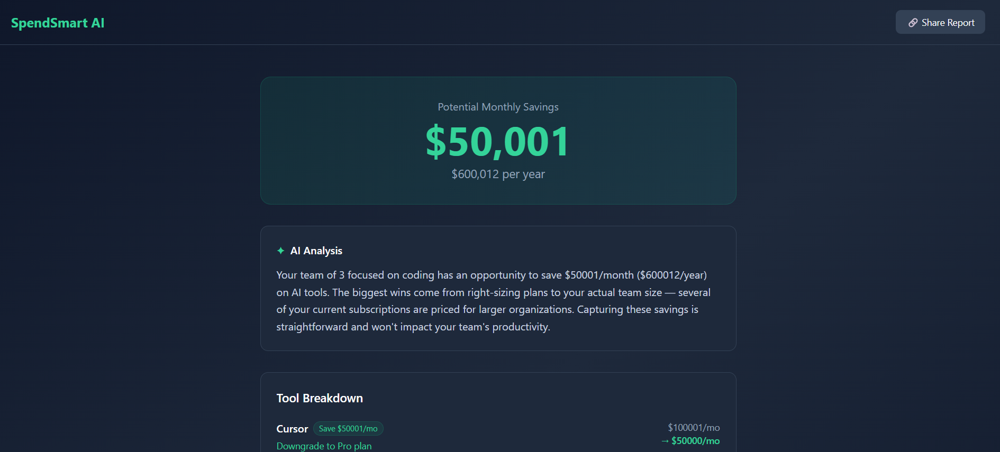

# SpendSmart AI — AI Spend Audit Tool

A free web app that audits your team's AI tool spend and surfaces real savings opportunities in under 2 minutes. Built as a lead generation asset for Credex — a marketplace for discounted AI infrastructure credits.

Who it is for: Startup founders and engineering managers paying for Cursor, Claude, ChatGPT, GitHub Copilot, and similar tools who have no benchmark for whether they are overspending.

## Screenshots

## Live URL

https://ai-spend-audit-xi-green.vercel.app/

## Quick Start

### Prerequisites

- Node.js 20+
- MongoDB Atlas account
- Gemini API key (aistudio.google.com)
- Resend API key (resend.com)

### Install and Run Locally

1. Clone the repo

git clone https://github.com/gauravkatre/ai_spend_audit.git
cd ai-spend-audit

2. Setup server

cd server
npm install
cp .env.example .env
Fill in your environment variables in .env

3. Setup client

cd ../client
npm install
cp .env.example .env

4. Run both

Terminal 1 — server:
cd server
npm run dev

Terminal 2 — client:
cd client
npm run dev

Open http://localhost:5173

### Deploy

Frontend: Connect GitHub repo to Vercel, set root to /client
Backend: Connect GitHub repo to Render, set root to /server, add environment variables

## Decisions

1. Vite over Next.js
This tool has no SEO requirements — users arrive via shared links or direct traffic, not Google search. Vite gives faster dev builds and simpler Vercel deployment without the overhead of SSR or file-based routing.

2. Hardcoded audit rules over AI-generated recommendations
The audit engine uses deterministic rules, not LLM calls. This keeps recommendations consistent, auditable, and defensible to a finance person. AI is used only for the summary paragraph where natural language adds value.

3. Zustand over Redux for state management
The app has simple shared state — form inputs and audit results. Zustand with localStorage persistence handles this in under 50 lines. Redux would add unnecessary boilerplate for a single-page audit flow.

4. MongoDB over PostgreSQL
Audit results vary in structure depending on how many tools a user selects. A flexible document schema fits this better than a rigid relational table. MongoDB Atlas free tier is also faster to set up for an MVP.

5. Email capture after value, never before
The lead capture form appears only on the results page after the user has seen their savings. Gating the audit behind an email would kill conversion — users need to see value first before they trust us with their contact details.